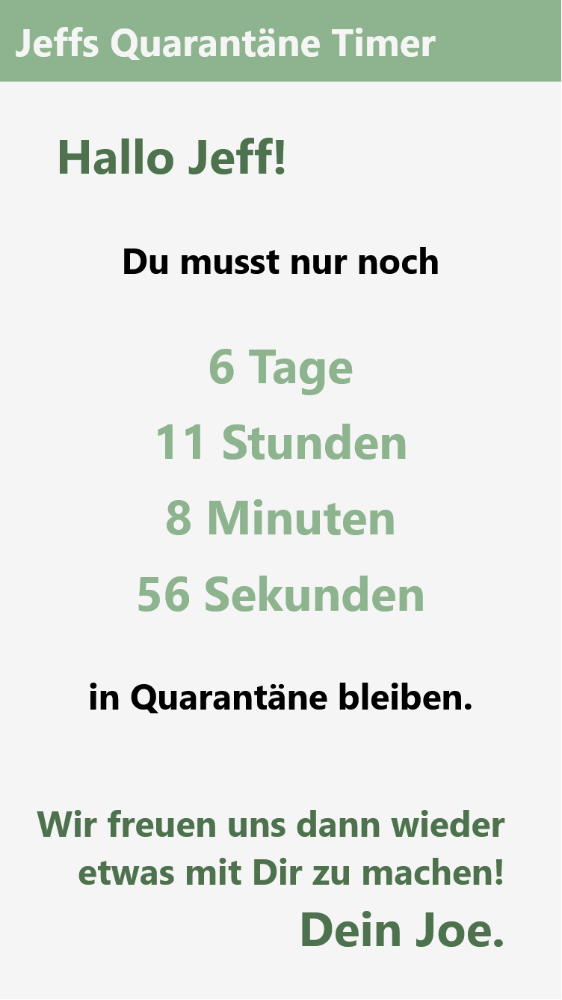

# Quarantine timer

 

### Send your friends a sweet message with a timer how long they have to stay in quarantine.

 

## How to use:

> - `https://itegs.github.io/quarantine-timer`

> - add the following parameters separated by a `&` to the link:
>
>   1. Date when the quarantine is over (`date=`YYYY-MM-DD)
>   1. Name of the reciver (`reciver=...`, optional)
>   1. Name of the sender (`sender=...`, optional)
>   1. Message (`message=...`, optional, `message=default` for default message)

### Example:

[https://itegs.github.io/quarantine-timer?date=2022-03-10&reciver=John&sender=Jane&message=I look forward to seeing you again soon.](https://itegs.github.io/quarantine-timer?date=2022-03-10&reciver=John&sender=Jane&message=I%20look%20forward%20to%20seeing%20you%20again%20soon.)
